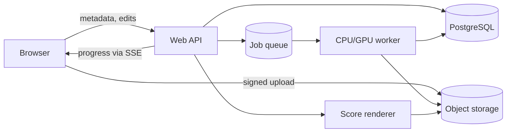
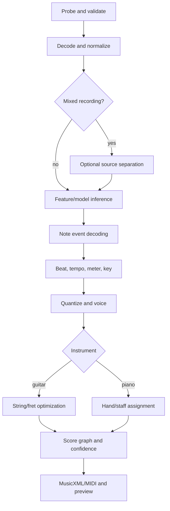

# AuraAudio architecture and implementation plan

## 1. Product definition

AuraAudio converts an uploaded audio or video file into an editable score containing standard notation and either guitar tablature or a piano grand staff. The first release should be an **assisted transcription tool**, not a promise of perfect automatic notation: polyphonic transcription, instrument separation, guitar fingering, and musical spelling are ambiguous, and a playable editor is the practical way to resolve those ambiguities.

### Assumptions

- The initial product is a browser application backed by a cloud service.
- The source is a user-owned file, initially MP3, WAV, M4A, MP4, or MOV, up to 15 minutes and 500 MB.
- The MVP handles one prominent guitar or piano part. Full-band transcription is a later capability.
- Output is MusicXML for interoperability, MIDI for playback, and PDF for printing.
- English-only UI, equal temperament, common guitar tunings, and conventional Western notation are acceptable for the MVP.
- Processing may take several minutes and therefore runs asynchronously.

Before implementation, product owners should confirm the target quality bar (learning aid versus publication-ready score), maximum file duration, supported guitar tunings, whether vocals/full mixes must work in the MVP, and the data-retention policy. These choices materially affect model work and infrastructure cost.

### Success criteria

For a curated, rights-cleared evaluation set:

- At least 90% of valid uploads enter a job and either complete or return an actionable error.
- A 5-minute file completes in less than 5 minutes at p95 under the agreed reference GPU and normal load.
- Note onset F1, note-with-offset F1, and frame F1 are reported separately by instrument and source type; launch thresholds are set only after a human baseline is measured.
- At least 80% of beta users can correct a result and export it without assistance.
- Guitar output contains only playable string/fret combinations for the selected tuning; piano output respects the configured keyboard range.
- No uploaded media remains beyond the configured retention period.

## 2. Scope and deliberate trade-offs

### MVP

1. Account or anonymous session, upload, validation, and processing progress.
2. Audio extraction and normalization from supported audio/video containers.
3. Guitar or piano selection, with optional crop, tuning, and tempo hints.
4. Automatic note/event transcription for one prominent part.
5. Rhythm, measure, key, and time-signature estimation with explicit confidence.
6. Guitar string/fret assignment or piano hand/staff assignment.
7. Browser score preview, synchronized audio playback, and basic corrections.
8. MusicXML, MIDI, and PDF export.

### Not in the MVP

- Live microphone transcription, streaming URLs, DRM-protected sources, collaboration, mobile-native clients, lyrics, arbitrary alternate temperaments, or publication-grade automatic engraving.
- Training a foundation transcription model from scratch. Start with a replaceable pretrained inference adapter and evaluate it against product data.
- Microservices for every stage. A modular worker is simpler until independent scaling or ownership is demonstrated.

### Key trade-offs

| Decision | Recommended starting point | Alternative and trigger |
|---|---|---|
| Processing | Asynchronous job | Synchronous only for short clips if p95 becomes reliably low |
| Deployment | Modular monolith API plus GPU worker | Split services when stages need distinct scaling/release cycles |
| Transcription | Pretrained model behind an adapter | Fine-tune after enough consented, labeled failure cases exist |
| Mixed audio | Offer optional source separation | Skip it for clean solo recordings; it can add artifacts |
| Canonical score | Internal event graph, then MusicXML | Direct MusicXML generation is simpler initially but makes editing and reprocessing brittle |
| Guitar fingering | Deterministic constrained optimizer | Learned fingering only if the optimizer cannot meet human preference benchmarks |
| Persistence | PostgreSQL plus object storage | A document database is unnecessary while job and score relationships are relational |

## 3. System context



### Recommended technology baseline

- **Web:** TypeScript and React, with a MusicXML-capable SVG score renderer and Web Audio for synchronized playback.
- **API:** Python with FastAPI and Pydantic. Python avoids a second runtime around the ML/audio pipeline.
- **Worker:** Python process using FFmpeg for decoding, PyTorch/ONNX Runtime as required by the selected model, and a queue such as Redis-backed RQ/Celery.
- **Data:** PostgreSQL for metadata and score revisions; S3-compatible object storage for source, normalized audio, stems, and exports.
- **Packaging:** OCI containers. Use one API image and one worker image initially; the worker image includes model weights or retrieves a versioned immutable artifact at startup.

These are defaults, not requirements. If the team already operates another queue or API stack, reuse it; model inference should remain a Python boundary and communicate through a versioned job contract.

## 4. Components and responsibilities

### 4.1 Web client

- Requests an upload, sends bytes directly to object storage, then creates a transcription job.
- Displays queued/running stage progress through Server-Sent Events (SSE), with polling fallback.
- Renders notation and tablature from MusicXML or the internal score projection.
- Keeps audio and cursor synchronized through a time map.
- Supports the minimum useful edits: add/delete/move note, duration, tie, accidental, string/fret, hand/staff, tempo, key, time signature, and measure boundary.
- Sends semantic edit operations with an expected revision number rather than replacing an entire score.

### 4.2 API application

- Authenticates users, authorizes every project/object operation, validates metadata, and issues short-lived signed upload/download URLs.
- Owns projects, jobs, score revisions, edit history, quotas, and export requests.
- Enqueues idempotent work and exposes progress and structured errors.
- Never proxies large media through the application process.

Suggested endpoints:

| Method and path | Purpose |
|---|---|
| `POST /v1/uploads` | Create an upload intent and signed URL |
| `POST /v1/projects` | Register an uploaded object and instrument settings |
| `POST /v1/projects/{id}/transcriptions` | Create an idempotent processing job |
| `GET /v1/jobs/{id}` | Return stage, percent, warnings, and error |
| `GET /v1/jobs/{id}/events` | Stream progress over SSE |
| `GET /v1/projects/{id}/score` | Return score projection and revision |
| `POST /v1/projects/{id}/edits` | Apply semantic edits with optimistic locking |
| `POST /v1/projects/{id}/exports` | Request MusicXML, MIDI, or PDF |
| `GET /v1/exports/{id}` | Return status and a signed download URL |
| `DELETE /v1/projects/{id}` | Delete metadata and schedule object removal |

All mutating requests accept an `Idempotency-Key`. A job conflict returns the existing job rather than scheduling duplicate GPU work.

### 4.3 Processing worker

The worker is a stage runner, with each stage reading immutable inputs and writing a versioned artifact plus metrics. A retry resumes from the last valid artifact.



#### Probe, decode, and normalize

1. Verify the actual container/codec with a media probe; do not trust the extension or client MIME type.
2. Reject duration, size, stream-count, and decode limits before expensive work. Ignore embedded scripts and metadata not required by the product.
3. Extract audio to mono or model-required channels at its expected sample rate using deterministic FFmpeg arguments.
4. Normalize loudness conservatively, retain a waveform proxy for the editor, and record the exact transform so event times map back to source time.
5. Crop silence only when the time-map records the offset.

#### Optional source separation

Run an instrument-separation adapter only for full mixes or on explicit user request. Keep the original and selected stem references. Separation is not assumed to improve every recording, so evaluate transcription confidence on the original and stem for a small sample, or expose a retry option instead of always doubling GPU cost.

#### Transcription inference and event decoding

- The `TranscriptionEngine` interface accepts normalized audio plus instrument and returns pitch activations/onsets or note events with confidence.
- Window long inputs with overlap, batch where memory permits, and reconcile duplicate notes in overlap regions deterministically.
- Convert frame predictions into events `(pitch, onset_s, offset_s, velocity, confidence)` using versioned thresholds.
- Store raw model output outside the database when large, enabling later decoders to be evaluated without rerunning inference.
- Pin model name, weights checksum, runtime, decoder version, and parameters on every job.

#### Musical structure and quantization

1. Estimate beats and tempo as a time-varying beat grid; do not force constant tempo.
2. Rank candidate meters and keys. Prefer user hints and expose low-confidence choices for correction.
3. Snap onsets/offsets to candidate subdivisions with a penalty for timing error, excessive tuplets, tiny rests, and unplayable overlaps.
4. Split notes across bar lines and generate ties.
5. Assign voices to avoid impossible overlaps and spell enharmonics using key and local harmonic context.
6. Preserve both performed time and notated time. Editing notation must not destroy audio synchronization.

#### Guitar string and fret assignment

For tuning pitches `T[s]`, pitch `p` is playable on string `s` at fret `f = p - T[s]` when `0 <= f <= maxFret`. Build all candidates per note/chord, then use dynamic programming or shortest-path search to minimize:

- fret-position movement and hand stretch;
- unnecessary string changes;
- impossible simultaneous reuse of a string;
- frets outside the preferred range;
- awkward barre shapes; and
- deviations from a user-locked string/fret.

Hard constraints always win over preferences. Chords require a bipartite assignment between pitches and distinct strings before transition scoring. Persist optimizer cost and alternative candidates so the editor can offer “next fingering” without retranscription. Techniques such as bends, slides, hammer-ons, pull-offs, harmonics, and capo inference are post-MVP because pitch alone does not identify them reliably.

#### Piano hand and staff assignment

Start with a deterministic sequence optimizer. Candidate split points are scored using pitch range, overlapping notes, chord membership, hand span, movement, and continuity. Middle-C is a weak prior, not a hard boundary. Assign voices after hands, allow cross-staff notation, and preserve a user lock. Pedal detection and detailed fingering are post-MVP.

### 4.4 Export and rendering

- Generate MusicXML as the interchange source, including divisions, measures, voices, ties, tempo map, tuning, and technical string/fret elements.
- Generate MIDI directly from performed events for faithful audition, and optionally a quantized MIDI variant.
- Render PDF in an isolated, resource-limited process from MusicXML using a mature notation engine.
- Validate generated MusicXML against its schema and reopen it in the chosen renderer as an export smoke test.

## 5. Canonical data model

Keep large binary artifacts in object storage. PostgreSQL stores references, lifecycle state, and compact editable score data.

```text
User 1---* Project 1---* MediaAsset
                 | 1---* TranscriptionJob 1---* StageArtifact
                 | 1---* ScoreRevision 1---* EditOperation
                 | 1---* Export
```

Core records:

- `Project(id, owner_id, title, instrument, tuning, settings, created_at, deleted_at)`
- `MediaAsset(id, project_id, kind, object_key, sha256, bytes, duration_ms, retention_until)`
- `TranscriptionJob(id, project_id, status, stage, progress, input_hash, pipeline_version, error_code, timestamps)`
- `StageArtifact(id, job_id, stage, version, object_key, sha256, metrics)`
- `ScoreRevision(id, project_id, parent_id, revision, score_json, created_by, created_at)`
- `EditOperation(id, revision_id, operation_type, payload, client_operation_id)`
- `Export(id, project_id, revision, format, status, object_key, expires_at)`

The canonical score is a versioned JSON event graph:

```json
{
  "schemaVersion": 1,
  "timeMap": [{"beat": 0, "seconds": 0.12}, {"beat": 1, "seconds": 0.61}],
  "parts": [{
    "instrument": "guitar",
    "measures": [{
      "number": 1,
      "events": [{
        "id": "note_01",
        "pitch": 64,
        "onsetSeconds": 0.61,
        "offsetSeconds": 1.08,
        "notatedOnset": "1/4",
        "notatedDuration": "1/4",
        "voice": 1,
        "string": 2,
        "fret": 5,
        "confidence": 0.91,
        "locked": false
      }]
    }]
  }]
}
```

Use rational numbers encoded as strings for notated beats/durations; floating point is acceptable for seconds only. Store confidence at the event and inferred-structure level. Schema migrations must be deterministic and fixtures must cover every supported version.

## 6. Job lifecycle, reliability, and scaling

Job states are `created -> uploaded -> queued -> running -> succeeded|failed|cancelled`. `running` has named stages. State transitions use a database compare-and-set so two workers cannot own the same attempt.

- Derive `input_hash` from media SHA-256, crop, instrument settings, and pipeline version. Reuse only artifacts belonging to the same authorized project or explicitly deduplicated server-side; never reveal cross-user matches.
- Each stage writes to a temporary object, verifies its checksum, promotes it, then records completion transactionally.
- Retry transient storage, worker-loss, and GPU out-of-memory errors with bounded attempts; do not retry corrupt/unsupported input.
- Use separate CPU and GPU queues, per-user concurrency quotas, maximum queue age, cancellation checks between windows, and dead-letter inspection.
- Autoscale GPU workers from queue wait time and oldest-job age. Begin with one model loaded per worker and measure before adding dynamic batching.
- Apply database migrations before workers that emit a new artifact schema. Keep the previous worker version until in-flight jobs drain.

Structured error codes include `UNSUPPORTED_MEDIA`, `MEDIA_TOO_LARGE`, `DECODE_FAILED`, `NO_MUSIC_DETECTED`, `INSTRUMENT_NOT_FOUND`, `MODEL_FAILED`, `EXPORT_FAILED`, and `INTERNAL_ERROR`. User text is separate from diagnostic detail.

## 7. Security, privacy, and rights

- Use direct signed uploads restricted by object key, content length, method, and short expiry. Place uploads in a private quarantine prefix.
- Validate decoded media, scan uploads according to the deployment threat model, and run FFmpeg/renderers as non-root with no network, read-only base filesystem, CPU/memory/time limits, and patched images.
- Encrypt transport and storage, keep secrets in a managed secret store, rotate signing keys, and prevent object keys or source filenames from entering logs.
- Enforce authorization in the API and in object URL issuance. Use opaque IDs and audit access, deletion, export, and administrative actions.
- Rate-limit uploads and job creation; enforce tenant storage/GPU quotas and protect all user-supplied text from injection in rendered pages and filenames.
- Define retention independently for original media, intermediate stems, raw predictions, scores, logs, and backups. Project deletion should create an auditable asynchronous purge and document backup expiry.
- Obtain explicit terms that users have rights to process uploaded content. Do not use uploads for training without separate, revocable consent and a documented dataset-deletion path.

## 8. Observability and cost controls

Propagate `request_id`, `project_id`, and `job_id` through API, queue, worker, and renderer; exclude user media and musical content from logs.

Monitor:

- upload success, queue wait, stage duration, end-to-end latency, completion/error/cancellation rates;
- GPU utilization/memory, seconds of audio processed per GPU-second, CPU, object bytes, and export time;
- model confidence distributions, note counts, tempo/meter overrides, edit distance from generated to final score, and export failures;
- cost per input minute by pipeline/model version; and
- retention purge lag and unauthorized-access attempts.

Alert on sustained completion-rate drops, queue-age SLO breaches, purge backlog, artifact checksum failures, and cost regressions. Model-quality metrics belong in offline evaluation, not just production dashboards, because confidence is not accuracy.

## 9. Testing and evaluation strategy

### Test pyramid

- **Unit:** time mapping, rational durations, quantizer costs, chord-to-string assignment, hand assignment, state transitions, authorization, and schema migration.
- **Property-based:** no overlapping notes on one guitar string, every fret reproduces its pitch for any supported tuning, measures sum correctly, tied durations preserve event length, and JSON/MusicXML round trips preserve semantics.
- **Integration:** real FFmpeg decode fixtures, object storage, queue retry/idempotency, model adapter on a short fixed clip, MusicXML validation, and PDF rendering.
- **End-to-end:** upload small audio/video fixtures, watch progress, edit a low-confidence note, reload, play in sync, and export all formats.
- **Security:** malformed containers, decompression/resource bombs, filename/XSS payloads, IDOR attempts, expired signed URLs, quota races, and deletion verification.
- **Load/failure:** concurrent long jobs, worker termination mid-stage, queue redelivery, database failover, full GPU memory, and renderer timeout.

### Model benchmark

Create versioned, rights-cleared splits across solo/mix, clean/noisy, acoustic/electric, genre, tempo, polyphony, recording device, and duration. Never tune on the test split. Report note onset F1, onset-plus-offset F1, frame F1, rhythm/beat metrics, meter/key accuracy, string/fret accuracy, playability violations, real-time factor, and peak memory. Add human review for readability and correction time because pitch metrics do not measure useful tablature.

Every production model or decoder change must beat or explicitly waive regression gates by cohort. Run shadow/canary evaluation before full rollout and retain the prior version for rollback.

## 10. Implementation plan

Each phase ends with a verifiable artifact; later work should not begin until the exit criteria are met.

### Phase 0 — product and feasibility (1–2 weeks)

1. Confirm assumptions, supported inputs, retention, rights language, and quality/cost targets.
2. Assemble a small representative evaluation set and a human-corrected reference format.
3. Spike two candidate transcription engines on 30–50 clips, with and without separation.
4. Prototype guitar fingering and piano hand assignment against ground truth.

**Exit:** a written benchmark report selects a baseline model/pipeline, records failure cohorts, estimates GPU cost per audio minute, and sets measurable MVP gates. Stop or narrow the input promise if prominent-instrument transcription is not viable.

### Phase 1 — vertical slice (2–3 weeks)

1. Establish repository layout, formatting, type checks, tests, container builds, and local PostgreSQL/object-store/queue dependencies.
2. Implement direct upload, project creation, one asynchronous job, FFmpeg normalization, baseline inference, event decoding, and artifact persistence.
3. Produce downloadable MIDI and minimal MusicXML from a short solo clip.
4. Add structured stage progress and errors.

**Exit:** a developer can upload a fixed guitar or piano fixture and receive deterministic MIDI/MusicXML twice without duplicate GPU processing; integration tests exercise the flow.

### Phase 2 — notation and instrument intelligence (3–5 weeks)

1. Implement beat/time map, quantization, meter/key candidates, voices, ties, and enharmonic spelling.
2. Implement constrained guitar string/fret optimization and piano hand/staff optimization with lock support.
3. Validate the canonical score schema and MusicXML, add synchronized SVG preview, and render PDF.
4. Run the offline benchmark in CI or a scheduled GPU pipeline and publish version comparisons.

**Exit:** all benchmark outputs are structurally valid and playable, no hard instrument constraints fail, quality gates are met, and exported fixtures reopen in at least two independent MusicXML consumers.

### Phase 3 — editing and beta reliability (3–4 weeks)

1. Add semantic edits, optimistic revisioning, undo/redo, confidence highlighting, audio loop/slowdown, and synchronization.
2. Add cancellation, bounded retry, quotas, retention purge, audit events, and actionable errors.
3. Add security tests, accessibility checks, dashboards, alerts, backups, restore drill, and runbooks.
4. Conduct a closed beta and measure correction time, final edit distance, completion rate, latency, and cost.

**Exit:** beta usability target and operational SLOs hold for two weeks; a deletion drill, restore drill, worker-loss test, and rollback test pass.

### Phase 4 — launch and evidence-driven expansion

1. Canary the chosen model and worker release; load-test at projected launch traffic.
2. Publish supported-source limitations and privacy/retention behavior.
3. Prioritize only measured failures: better separation, alternate tunings/capo, techniques, pedal, multi-instrument parts, or fine-tuning.

**Exit:** launch checklist is approved, dashboards and on-call ownership exist, cost limits are enforced, and rollback is rehearsed.

## 11. Suggested repository boundaries

```text
apps/
  web/                 # browser UI
  api/                 # HTTP/SSE API and persistence
workers/
  transcription/       # stage runner and model adapters
packages/
  score-schema/        # schema, migrations, fixtures
  musicxml/            # import/export and validation
  test-fixtures/       # small rights-cleared media and expected output
infra/                 # local compose and deployment manifests
docs/                  # ADRs, runbooks, benchmark reports
```

Keep model adapters, musical post-processing, and infrastructure interfaces separate, but do not split them into network services prematurely. Record consequential decisions—model, score representation, renderer, retention, and queue—in short architecture decision records.

## 12. Definition of done for the MVP

- Upload, processing, editing, playback synchronization, and three exports work for guitar and piano fixtures.
- The versioned benchmark meets its approved cohort gates and is reproducible from pinned artifacts.
- Job operations are idempotent; retries and worker loss do not corrupt or duplicate results.
- Guitar notes are playable for the selected tuning and piano notes are within range; schema and MusicXML validators pass.
- Authorization, malicious-media, quota, retention, and deletion tests pass.
- p95 latency, completion rate, GPU cost per minute, and purge lag are visible and within agreed limits.
- User-facing limitations, privacy behavior, operational runbooks, backups, rollback, and incident ownership are documented.
